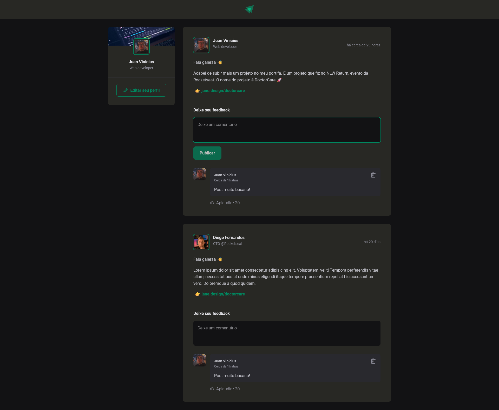
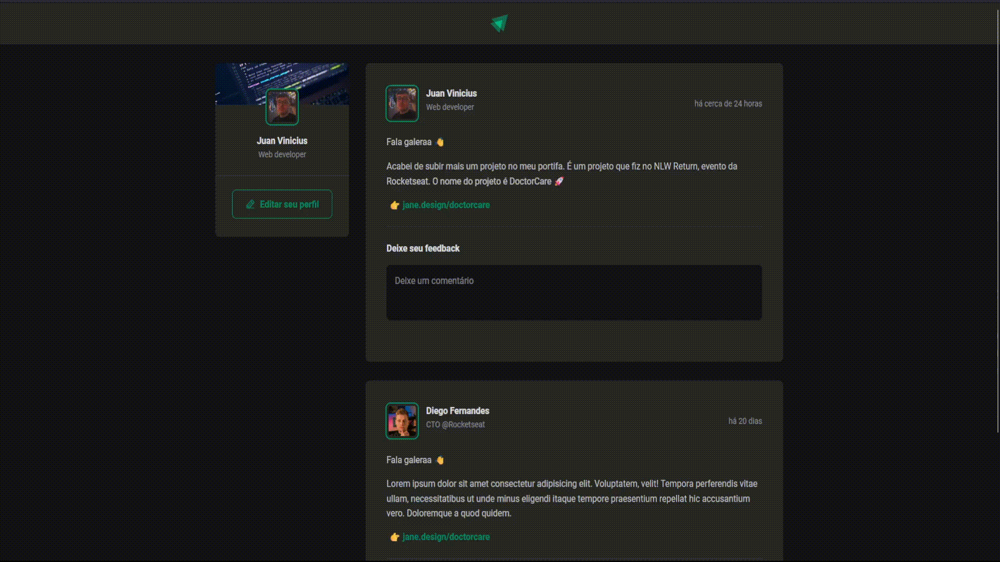

# Ignite feed

Projeto feito durante o aprendizado da trila de **ReactJS** no Ignite da Rocketseat. Durante o periodo de 2 dias foram disponibilizados acessos gratuitos a plataforma, desta forma utilizei para aprender mais sobre ReactJS, desenvolvendo essa aplicação. Fazendo essa aplicação aprendi os conceitos basicos de react, como: useState, imutabilidade, conceito de props e css module.

## Techs usadas

* ReactJS
* Vite
* Date-fns (Bibiloteca para formatação de datas)
* Phosphor-react (Bibiloteca para icones)

## Screenshots

